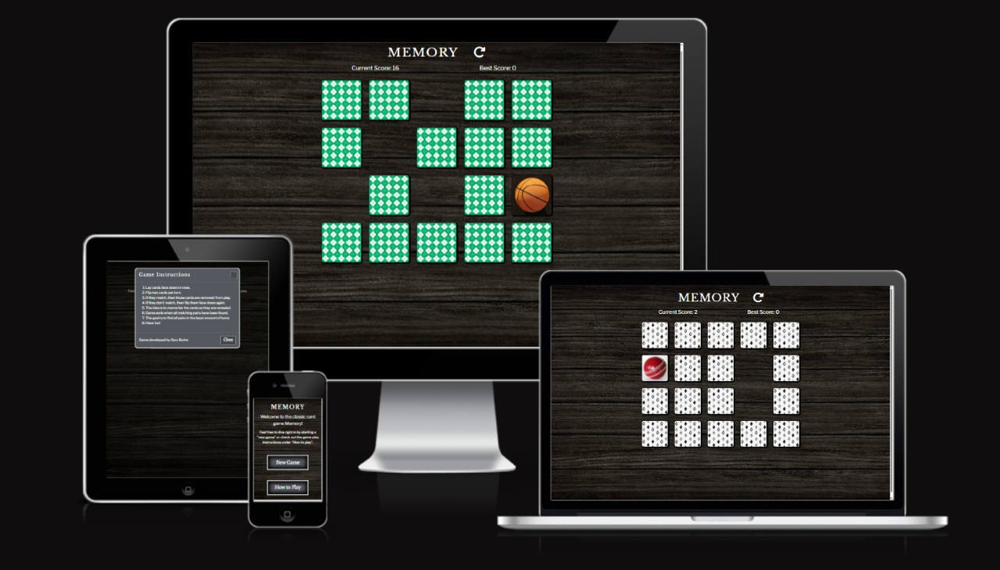
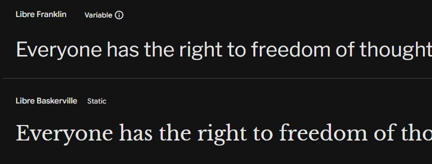
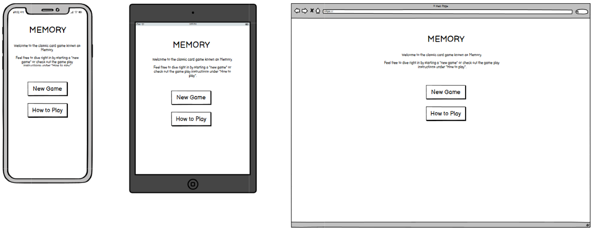
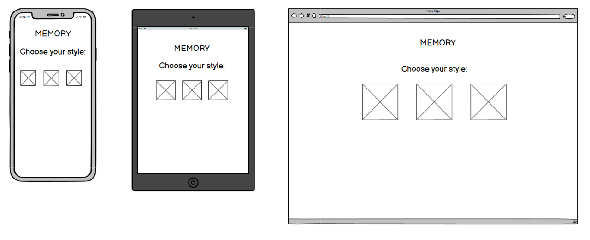
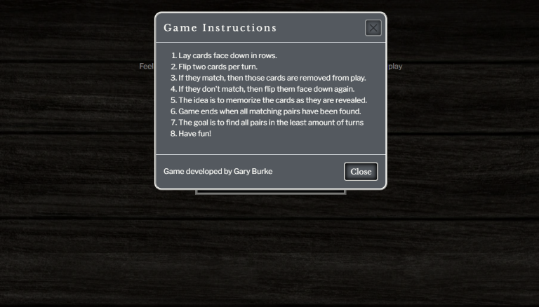
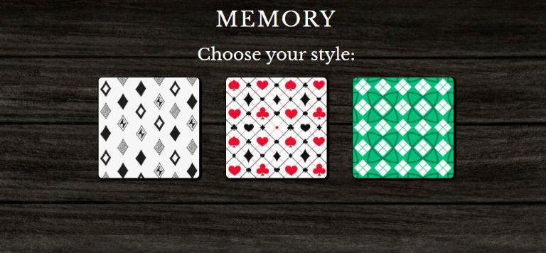
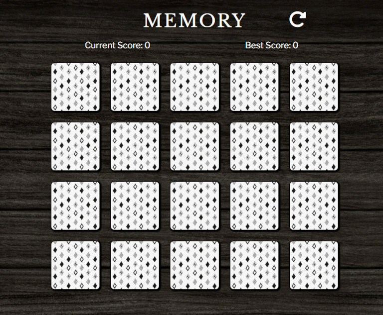
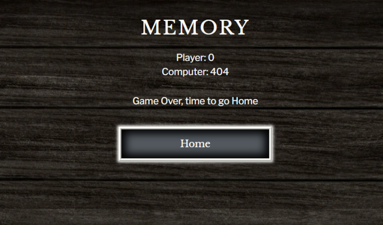
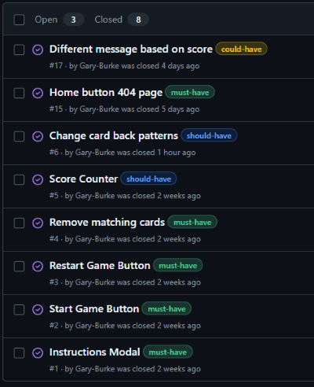

# [Memory Card Game]((https://gary-burke.github.io/memory-card-game))

Developer: Gary Burke ([Gary-Burke](https://www.github.com/Gary-Burke))

## Introduction ##

Memory is a classic card game that has been enjoyed by millions of players worldwide, spanning all ages and cultures. The primary goal of this website is to bring the card game online, providing players with a fun and interactive experience while they play.

The live website can be viewed here: [Memory Card Game](https://gary-burke.github.io/memory-card-game/)

---

## User Experience

### User Stories

- As a first-time player, I would like to be able to find instructions very easily on the home page, so that I don’t get overwhelmed or confused.

- As an experienced player, I would like to be able to start the game without having to read through the instructions, so that I can immediately start to have fun.

- As a first-time player, I would like the option of ending the game without having to complete it in case I get frustrated and want to start over.

- As a player, there needs to be some form a visual confirmation when a matching pair has been found, so that it gets removed from the active selection choices/game, without changing the remaining card positions.

- As an experienced player, I would like to have a score count, so that I can try and beat my best score.

- As a player, it would be useful to have a home button, when a 404 error message is displayed,

- As a player, it would be amusing to see a different type of message displayed, depending on the final score.

- As a player, it would be a fun experience, to be able to change the backside pattern of the cards.

## Design

### Typography

I have used [Google Fonts](https://fonts.google.com/) for this project and chose the following two fonts:

- **Libre Franklin:** Used for all the general text on the website. This font provides the perfect blend of contrast to the heading font while still complementing it at the same time. 

- **Libre Baskerville:** Used for all the main headings in the website. This font has a classic and vintage feeling to it and fits well with the concept of a classic card game.

### Colour Scheme

Keeping with the classic and vintage style, I opted for a wooden table as the main background image. This creates a simulation of playing cards on a table. The rest of the colours provide excellent contrast between all elements on the website. A monochrome scheme was deliberately selected because of all the colourful and various pictures that will appear during the game.

I used [Coolors](https://coolors.co/35302c-53595f-fefefa-000000) to generate the colour palette for the main colours of this website:

### Accessibility Considerations

In order to ensure proper contrast and accessibility between the colours for readability, I used [webaim](https://webaim.org/resources/contrastchecker/) to check and adjust the colour variations accordingly.

To test and ensure that there is an adequate contrast between the two fronts, I used [fontjoy](https://fontjoy.com/).

### Wireframes

For this project, I used Balsamiq to plan and draft the wireframes.

The Home Page (<em>Click to expand the wireframe</em>)

Instructions Modal (<em>Click to expand the wireframe</em>)

Backside Patterns (<em>Click to expand the wireframe</em>)

The Game Page (<em>Click to expand the wireframe</em>)

> [!NOTE]
> I have opted to replace the initial "New Game" button at the bottom of this page with a suitable icon at the top.

## Features

### Current Features

- **The Home page**
  - The home page is designed with a classic and vintage style, where a wooden table is displayed as the main background image. 
  - The name of the game, Memory, is clearly displayed at the top of the page as the title, followed by a short welcome message and brief introduction
  - Two buttons have been placed below this section, where a first-time player can easily open the instructions modal or an experienced player can effortlessly start a new game.
  - Each button also has a hover effect that displays a white box-shadow around it.
  - 

- **Game Instructions**
  - Upon clicking the "How to Play" button, a clean and neat modal pops up, allowing the player to immediately read the instructions and then closing it.
  - Without having to navigate between pages and sections, this provides a smooth and fluid experience for the user.
  - As it is a modal, the user can simply close it by clicking on the "X" in the corner or on the "Close" button.
  - 

- **Card Backside**
  - Upon choosing a new game, the player will be presented with a choice of three different images, which they can choose from, to use as the backside pattern for the cards during their game.
  - After each game, the player will be given this prompt again, making the visual layout interactive and fun for the player.
  - 

- **The Game Page**
  - The game page keeps the exact same wooden table as the background image. The name of the game is also displayed clearly at the top of the page.
  - Then the user is met with an elegant layout of cards, all turned face down. Each card has the same hover effect as with the buttons, so as to make it clear to the player which card he or she is about to select.
  - 

- **Finding Matching Pairs**
  - As soon as the player successfully finds two matching cards, they will be revealed briefly and then removed from the game. This is done without influencing or changing the current position of the remaining cards, so that the player does not get confused or have a bad playing experience.
  - 

- **The Header Section**
  - Next to the title of the game, there is a restart game icon, with a similar hover effect as the other elements within the website.
  -  When clicked, this button allows the player to reset the current game. The best score will not be erased but the current score will. All the cards will be turned face down again and their positions will be randomized. This adds value to the player, who simply wants to beat his best score and doesn't have to finish the game, if the score is out of reach.
  - The title in the header, "MEMORY", will navigate the player back to the home page when clicked. This also has a hover effect.
  - Below the title and icon, the player's current score and best score will be displayed and updated accordingly, as they play.
  - 

- **Game Over**
  - As soon as the player finds the last matching pair, a message box will appear congratulating the player. In addition to that, if the best score has been beaten, then the message will inform the player of that achievement as well.
  - For ease of play and without any navigation, the player can simply click on the button "New Game" and it will start a new round, keeping the best score displayed on the board.
  - 

- **404**
  - In the event of a 404 error, a suitable message will appear with a button to safely guide the player back to the home page.
  - 

### Future Features

- It would be beneficial to add the option for the user to choose the board size, i.e., how many tiles to play with.

- It would be fun, if the user could choose between different themes for the card images' content to play with.

- It would be a nice feature, if the user could choose to play some sort of music or tune during the game.

- As a player, it would be a fun experience, to be able to change the backside pattern of the cards.

 ## Tools & Technologies

| Tool / Tech | Use |
| --- | --- |
|  | Generate README and TESTING templates. |
|  | Version control. (`git add`, `git commit`, `git push`) |
|  | Secure online code storage. |
|  | Local IDE for development. |
|  | Main site content and layout. |
|  | Design and layout. |
|  | User interaction on the site. |
|  | Hosting the deployed front-end site. |
|  | Front-end CSS framework for modern responsiveness and pre-built components. |
|  | Creating wireframes. |
|  | Icons. |
|  | Tutorials/Reference Guide |
|  | Troubleshooting and Debugging |
|  | Image Manipulation |
|  | Parses CSS and adds vendor prefixes |

### Additional Tools

| Tool / Tech | Use |
| --- | --- |
| [favicon.io](https://favicon.io)  | Generate favicon |
| [Am I Responsive](https://ui.dev/amiresponsive)  | Generate a responsive design screenshot for the README file |
| [grammarly](https://app.grammarly.com/) | Used to check spelling and grammar of README and TESTING files |

## Development Process

### GitHub Projects

GitHub Projects was used as the tool for the planning and tracking of the website's development. I created one project for both user stories and bugs. It can be viewed by clicking this link: [GitHub Projects](https://github.com/users/Gary-Burke/projects/7) 

### GitHub Issues

[GitHub Issues](https://www.github.com/Gary-Burke/memory-card-game/issues) served as another Agile tool. There, I managed my User Stories and Milestone tasks, and tracked any issues/bugs.

| Link | Screenshot |
| --- | --- |
|  |  |
|  |  |

### MoSCoW Prioritization

I have listed my Epics into User Stories and applied the "MoSCoW" prioritization method with corresponding labels to them, within the Issues tab.

- **Must Have**: Critical tasks that need to be met for the project to pass.
- **Should Have**: These are valuable features, but not critical.
- **Could Have**: Nice to haves, but don't have a crucial impact.
- **Won't Have**: Future features.

## Deployment

### GitHub Pages

The site was deployed to GitHub Pages. The steps to deploy are as follows:

- In the [GitHub repository](https://github.com/Gary-Burke/memory-card-game), navigate to the Settings tab 
- From the source section drop-down menu, select the **Main** Branch, then click "Save".
- The page will be automatically refreshed with a detailed ribbon display to indicate the successful deployment.

The live link can be found [here](https://gary-burke.github.io/memory-card-game)

### Local Deployment

This project can be cloned or forked in order to make a local copy on your own system.

#### Cloning

You can clone the repository by following these steps:

1. Go to the [GitHub repository](https://github.com/Gary-Burke/memory-card-game) 
2. Locate the Code button above the list of files and click it 
3. Select if you prefer to clone using HTTPS, SSH, or GitHub CLI and click the copy button to copy the URL to your clipboard
4. Open Git Bash or Terminal
5. Change the current working directory to the one where you want the cloned directory
6. In your IDE Terminal, type the following command to clone my repository:
  - `git clone https://github.com/Gary-Burke/memory-card-game.git`
7. Press Enter to create your local clone.

Alternatively, if using Gitpod, you can click below to create your own workspace using this repository.

Please note that in order to directly open the project in Gitpod, you need to have the browser extension installed.
A tutorial on how to do that can be found [here](https://www.gitpod.io/docs/configure/user-settings/browser-extension).

#### Forking

By forking the GitHub Repository, we make a copy of the original repository on our GitHub account to view and/or make changes without affecting the original owner's repository.
You can fork this repository by using the following steps:

1. Log in to GitHub and locate the [GitHub Repository](https://github.com/Gary-Burke/memory-card-game)
2. At the top of the Repository (not top of page), just above the "Settings" Button on the menu, locate the "Fork" Button.
3. Once clicked, you should now have a copy of the original repository in your own GitHub account!

### Local VS Deployment

There are no differences between the local and deployed versions of the site.

## Testing

- For all testing, please refer to the [TESTING.md](TESTING.md) file.

## Credits

### Content

| Source | Notes |
| --- | --- |
| [Chris Beams](https://chris.beams.io/posts/git-commit) | "How to Write a Git Commit Message". |
| [Markdown Builder](https://markdown.2bn.dev) | Help generating Markdown files. |
| [Code Institute](https://codeinstitute.net) | Code Institute lotto numbers challenge inspiration |
| [stackoverflow](https://stackoverflow.com/) | Used for troubleshooting, debugging and coding solutions and [setTimeout function](https://stackoverflow.com/a/1183886/30846754) |
| [chatGPT](https://https://chatgpt.com/) | How to create an isProcessing flag to ignore clicks (event listeners) during functions |
| [Wes Bos](https://www.youtube.com/watch?v=YL1F4dCUlLc&t=884s) | Youtube video on local storage  |

### Media

| Source | Notes |
| --- | --- |
| [favicon.io](https://favicon.io) | Generating the favicon |
| favicon image | Image designed by aviyabc - Freepik |
| [Font Awesome](https://fontawesome.com) | Icons used throughout the site |
| [Freepik](https://www.freepik.com/) | All images used in this website are from Freepik |

### Acknowledgements

- I would like to thank my Code Institute mentor, [Tim Nelson](https://www.github.com/TravelTimN) for the support throughout the development of this project.
- I would like to thank my wife, for her support and encouragement during this learning experience.

