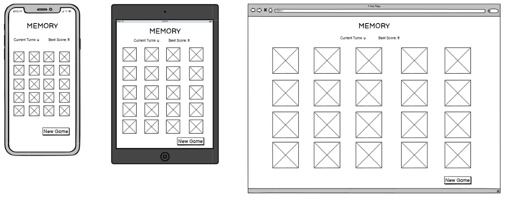
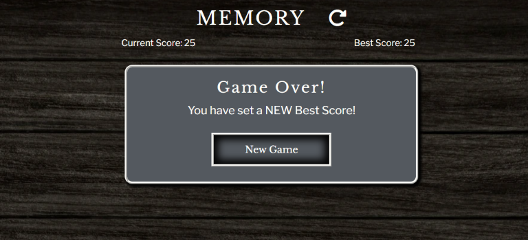

# Memory Card Game

Developer: Gary Burke ([Gary-Burke](https://www.github.com/Gary-Burke))

## Introduction ##

Memory is a classic card game that has been enjoyed by multitudes of players all over the world from all different ages and cultures. The main goal of this website is to make this card game digital and allow players to have a fun and interactive experience online, while playing this card game.

The live website can be viewed here: [Memory Card Game](https://gary-burke.github.io/memory-card-game/)

---

## User Experience

### User Stories

- As a first-time player, I would like to be able to find instructions very easily on the home page, so that I don’t get overwhelmed or confused.

- As an experienced player, I would like to be able to start the game without having to read through the instructions, so that I can immediately start to have fun.

- As a first-time player, I would like the option of ending the game without having to complete it in case I get frustrated and want to start over.

- As a player, there needs to be some form a visual confirmation when a matching pair has been found, so that it gets removed from the active selection choices/game, without changing the remaining card positions.

- As an experienced player, I would like to have a score count, so that I can try and beat my best score.

- As a player, it would be a fun experience, to be able to change the back side pattern of the cards.

## Design

### Typography

I have used [Google Fonts](https://fonts.google.com/) for this project and chose the following two fonts:

- **Libre Franklin:** Used for all the general text on the website. This font provides the perfect blend of contrast to the heading font while still complementing it at the same time. 

- **Libre Baskerville:** Used for all the main headings in the website. This font has a classic and vintage feeling to it and fits well with the concept of a classic card game.

### Colour Scheme

Keeping with the classic and vintage style, I opted for a wooden table as the main background image. This create this simulation of playing cards on a table. The rest of the colours provide excellent contrast between all elements on the website.

I used [Coolors](https://coolors.co/35302c-53595f-fefefa-000000) to generate the colour palette for the main colours of this website:

### Accessibility Considerations

In order to ensure proper contrast and accessibility between the colours for readability, I used [webaim](https://webaim.org/resources/contrastchecker/) to check and adjust the colour variations accordingly.

To test and ensure that there is an adequate contrast between the two fronts, I used [fontjoy](https://fontjoy.com/).

### Wireframes

For this project, I used Balsamiq to plan and draft the wireframes.

The Home Page (<em>Click to expand the wireframe</em>)

Instructions Modal (<em>Click to expand the wireframe</em>)

The Game Page (<em>Click to expand the wireframe</em>)

## Features

### Current Features

- **The Home page**

  - The home page is designed with a classic and vintage style, where a wooden table is displayed as the main background image. 
  - The name of the game, Memory, is clearly displayed at the top of the page as the title, foloowed by a short welcome message and brief introduction
  - Two buttons have been placed below this section, where a first time player can easily open the instructions modal or an experienced player can effortlessly start a new game.
  - Each button also has a hover effect the displays a white box-shadow around it.
 

- **Game Instructions**

  - Upon clicking the "How to Play" button, a clean and neat modal pops up, allowing the player to immediately read the instruction and then closing them.
  - Without having to navigate between pages and sections, this provides a smooth and fluid experience for the user.
  - As it is a modal, the user can simply close it by clicking on the "X" in the corner or on the "Close" button.
 

- **The Game Page**

  - The game page keeps the exact same wooden table as the background image. The name of the game is also displayed clearly at the top of the page.
  - Then the user is met with an elegant layout of cards, all turned face down. Each card has the same hover effect as with the buttons, so as to make it clear to the player which card he or she is about to select.
 

 - **Finding Matching Pairs**

  - As soon as the player successfully find two matching cards, they will be revealed briefly and then removed from the game. This is done without influencing or changing the currect position of the remaining cards, so that the player does not get confused or have a bad playing experience.
 

  - **The Header Section**

  - Next to the title of the game there are two icons, each having a similar hover effect as the rest of the website.
  -  The first icon is the reset button. When clicked, this allows the player to reset the current game. The best score will not be erased but the current score will. All the cards will be turned face down again and their positions will be randomized. This adds value to the player, who simply wants to beat his best score and doesn't have to finish the game, if the score is out of reach.
  - The second icon is the home button. When clicked, the player will be taken back to the home page. This allows for easy navigation and avoids confusion.
  - Below these icons, the player's current score and best score will be displayed and updated accordingly, as they play.
 

   - **Game Over**

  - As soon as the player finds the last matching pair, a message box will appear congratulating the player. In addition to that, if the best score has been beaten, then the message will inform the player of that achievement as well.
  - For ease of play and without any navigation, the player can simply click on the button "New Game" and it will start a new round, keeping the best score displayed on the board.
 

 - **404**

  - In the event of a 404 error, a suitable message will appear with a button to safely guide the player back to the home page.
 