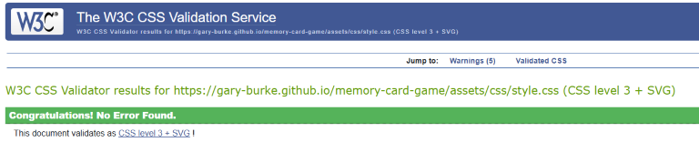
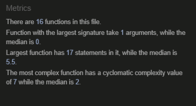
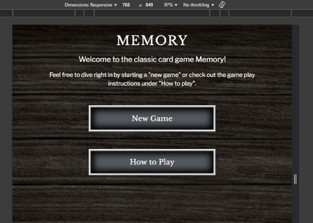
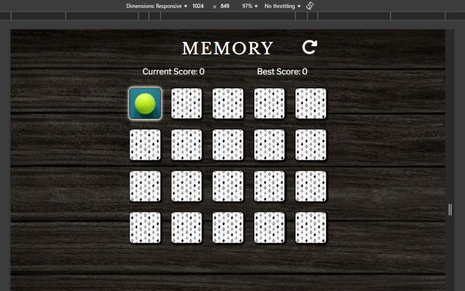
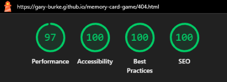
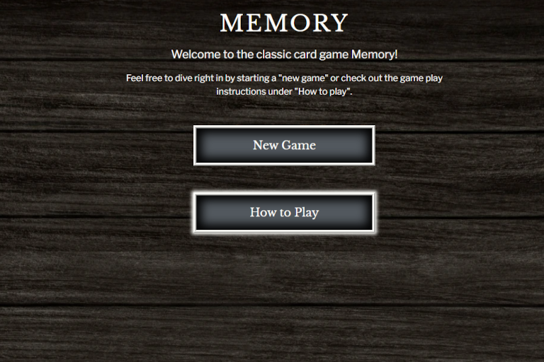
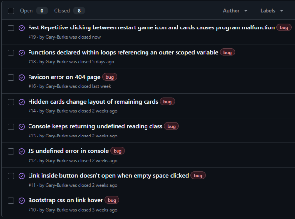

# Testing

> [!NOTE]
> Return back to the [README.md](README.md) file.

## Code Validation

### HTML

I have used the recommended [HTML W3C Validator](https://validator.w3.org) to validate all of my HTML files and the results can also be seen in the URLs below.

| Directory | File | URL | Screenshot | Notes |
| --- | --- | --- | --- | --- |
| root | [index.html](https://github.com/Gary-Burke/memory-card-game/blob/main/index.html) | [HTML Validator](https://validator.w3.org/nu/?doc=https%3A%2F%2Fgary-burke.github.io%2Fmemory-card-game%2Findex.html) |  | No errors or warnings. However the console reports a warning for aria-hidden on an element but this is due to the Bootstrap modal but it's used correctly. |
| root | [game.html](https://github.com/Gary-Burke/memory-card-game/blob/main/game.html) | [HTML Validator](https://validator.w3.org/nu/?doc=https%3A%2F%2Fgary-burke.github.io%2Fmemory-card-game%2Fgame.html) |  | No errors or warnings |
| root | [404.html](https://github.com/Gary-Burke/memory-card-game/blob/main/404.html) | [HTML Validator](https://validator.w3.org/nu/?doc=https%3A%2F%2Fgary-burke.github.io%2Fmemory-card-game%2F404.html) |  | No errors or warnings |

### CSS

I have used the recommended [CSS Jigsaw Validator](https://jigsaw.w3.org/css-validator) to validate my CSS file and the results can also be seen in the URL below.

| Directory | File | URL | Screenshot | Notes |
| --- | --- | --- | --- | --- |
| assets | [styles.css](https://github.com/Gary-Burke/memory-card-game/blob/main/assets/css/style.css) | [CSS Validator](https://jigsaw.w3.org/css-validator/validator?uri=https%3A%2F%2Fgary-burke.github.io%2Fmemory-card-game%2F&profile=css3svg&usermedium=all&warning=1&vextwarning=&lang=en) |  | All warnings were checked and can be safely ignored, as they are based on CSS font variables.

### JS

I have used the recommended [JSHint Validator](https://jshint.com/) to validate my JS code and the results can be seen below. 

| Directory | File | Screenshot | Notes |
| --- | --- | --- | --- |
| assets | [script.js](https://github.com/Gary-Burke/memory-card-game/blob/main/assets/js/script.js) |  | No errors or warnings |

## Responsiveness

I've tested my deployed project to check for responsiveness issues by using Google Chrome Dev Tools.

| Page | Mobile | Tablet | Desktop | Notes |
| --- | --- | --- | --- | --- |
| Home |  |  |  | Works as expected |
| Instructions |  |  |  | Works as expected |
| Backside Patterns |  |  |  | Works as expected |
| Game |  |  |  | Works as expected |
| Game Over |  |  |  | Works as expected |
| 404 |  |  |  | Works as expected |

## Browser Compatibility

I've tested my deployed project on three different browsers to check for compatibility issues.

| Page | Chrome | Firefox | Edge | Notes |
| --- | --- | --- | --- | --- |
| Home |  |  |  | Works as expected |
| Instructions |  |  |  | Works as expected |
| Game |  |  |  | Works as expected |
| Game Over |  |  |  | Works as expected |
| 404 |  |  |  | Works as expected |

## Lighthouse Audit

I've tested my deployed project using the Lighthouse Audit tool to check for any major issues. Some warnings are outside of my control, and mobile results tend to be lower than desktop.

| Page | Mobile | Desktop |
| --- | --- | --- |
| Home |  |  |
| Game |  |  |
| 404 |  |  |

## Defensive Programming
Defensive programming was manually tested and implemented for the following scenarios:
> [!NOTE]
> No screenshots have been provided, as this is a dynamic testing, which can't be shown by static screenshots.

- The game should block/ignore all clicks from the player, if the player clicks on the same card repetitively.
- The game should block/ignore all clicks from the player, while the cards are being turned around.

## User Story Testing

| Target | Expectation | Outcome | Screenshot | 
| --- | --- | --- | --- | 
| As a first-time player | I would like to be able to find instructions very easily on the home page | so that I don’t get overwhelmed or confused. |  |
| As an experienced player | I would like to be able to start the game without having to read through the instructions | so that I can immediately start to have fun. |  |
| As a first-time player | I would like the option of ending the game without having to complete it  | in case I get frustrated and want to start over |  |
| As a player | there needs to be some form a visual confirmation when a matching pair has been found, so that it gets removed from the active selection choices/game | without changing the remaining card positions. |  |
| As an experienced player |  I would like to have a score count | so that I can try and beat my best score. |  |
| As a player |  it would be useful to have a home button when a 404 error message is displayed | so that I can easily navigate back. |  |
| As a player | it would be amusing to see a different type of message displayed | depending on the final score. |  |

## Bugs

### Fixed Bugs

I've used [GitHub Issues](https://www.github.com/Gary-Burke/memory-card-game/issues) to track and manage bugs and issues during the development stages of my project.

All previously closed/fixed bugs can be tracked [here](https://www.github.com/Gary-Burke/memory-card-game/issues?q=is%3Aissue+is%3Aclosed+label%3Abug).

### Unfixed Bugs

Any remaining open issues can be tracked [here](https://www.github.com/Gary-Burke/memory-card-game/issues?q=is%3Aissue+is%3Aopen+label%3Abug).

> [!IMPORTANT]  
> There are no remaining bugs that I am aware of, though, even after thor