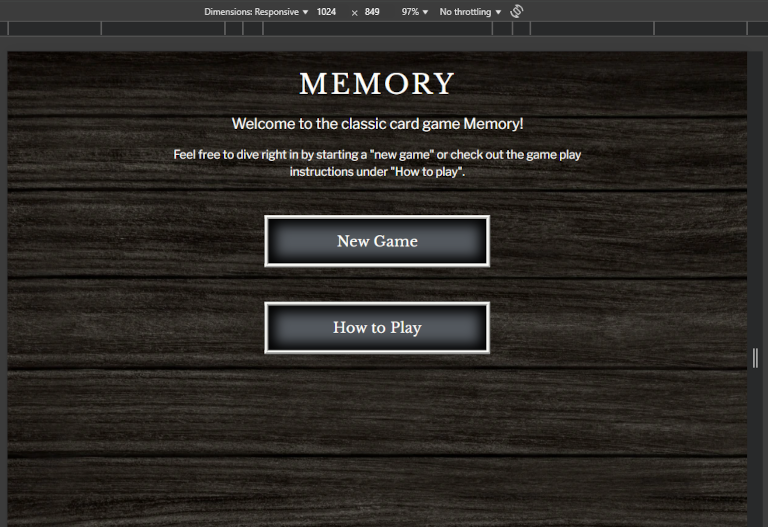
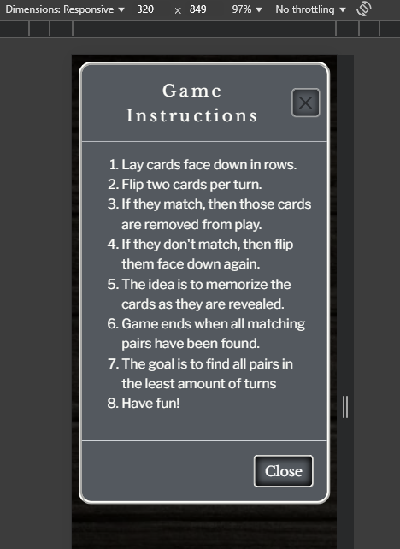
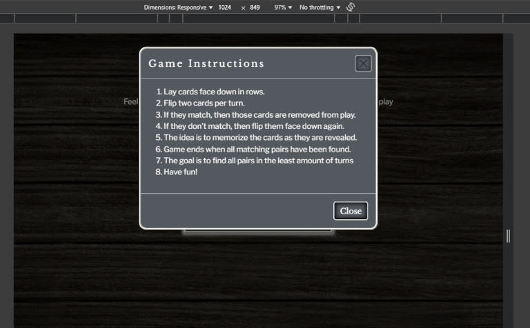
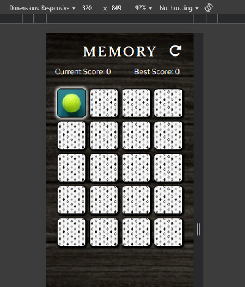
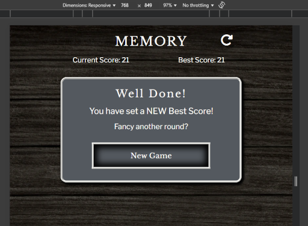
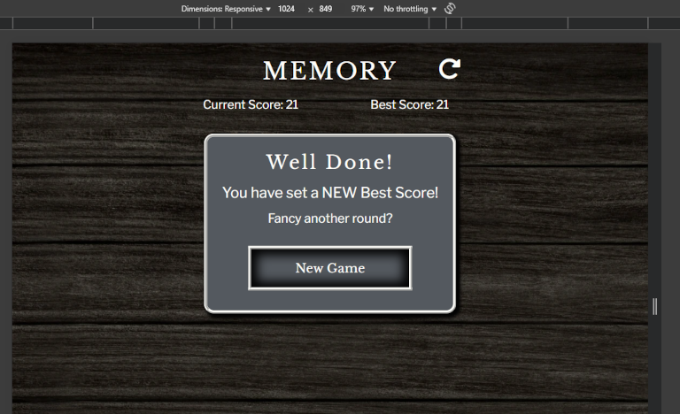
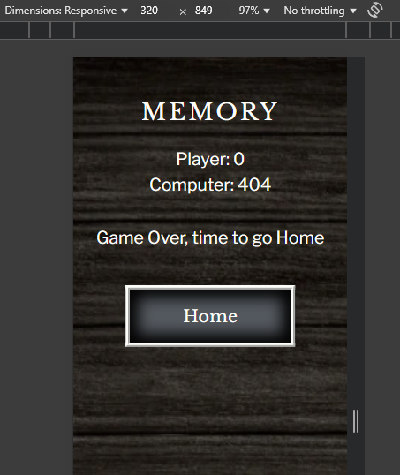
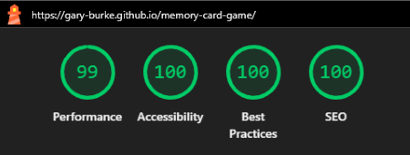
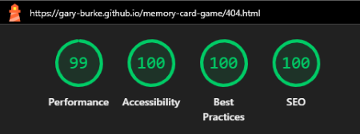

# Testing

> [!NOTE]
> Return back to the [README.md](README.md) file.

## Code Validation

### HTML

I have used the recommended [HTML W3C Validator](https://validator.w3.org) to validate all of my HTML files and the results can also be seen in the URLs below.

| Directory | File | URL | Screenshot | Notes |
| --- | --- | --- | --- | --- |
| root | [index.html](https://github.com/Gary-Burke/memory-card-game/blob/main/index.html) | [HTML Validator](https://validator.w3.org/nu/?doc=https%3A%2F%2Fgary-burke.github.io%2Fmemory-card-game%2Findex.html) |  | No errors or warnings |
| root | [game.html](https://github.com/Gary-Burke/memory-card-game/blob/main/game.html) | [HTML Validator](https://validator.w3.org/nu/?doc=https%3A%2F%2Fgary-burke.github.io%2Fmemory-card-game%2Fgame.html) |  | No errors or warnings |
| root | [404.html](https://github.com/Gary-Burke/memory-card-game/blob/main/404.html) | [HTML Validator](https://validator.w3.org/nu/?doc=https%3A%2F%2Fgary-burke.github.io%2Fmemory-card-game%2F404.html) |  | No errors or warnings |

### CSS

I have used the recommended [CSS Jigsaw Validator](https://jigsaw.w3.org/css-validator) to validate my CSS file and the results can also be seen in the URL below.

| Directory | File | URL | Screenshot | Notes |
| --- | --- | --- | --- | --- |
| assets | [styles.css](https://github.com/Gary-Burke/memory-card-game/blob/main/assets/css/style.css) | [CSS Validator](https://jigsaw.w3.org/css-validator/validator?uri=https%3A%2F%2Fgary-burke.github.io%2Fmemory-card-game%2F&profile=css3svg&usermedium=all&warning=1&vextwarning=&lang=en) |  | All warnings were checked and can be safely ignored, as they are based on external libraries and frameworks.

## Responsiveness

I've tested my deployed project to check for responsiveness issues by using Google Chrome Dev Tools.

| Page | Mobile | Tablet | Desktop | Notes |
| --- | --- | --- | --- | --- |
| Home |  |  |  | Works as expected |
| Instructions |  |  |  | Works as expected |
| Game |  |  |  | Works as expected |
| Game Over |  |  |  | Works as expected |
| 404 |  |  |  | Works as expected |

## Browser Compatibility

I've tested my deployed project on three different browsers to check for compatibility issues.

| Page | Chrome | Firefox | Edge | Notes |
| --- | --- | --- | --- | --- |
| Home |  |  |  | Works as expected |
| Instructions |  |  |  | Works as expected |
| Game |  |  |  | Works as expected |
| Game Over |  |  |  | Works as expected |
| 404 |  |  |  | Works as expected |

## Lighthouse Audit

I've tested my deployed project using the Lighthouse Audit tool to check for any major issues. Some warnings are outside of my control, and mobile results tend to be lower than desktop.

| Page | Mobile | Desktop |
| --- | --- | --- |
| Home |  |  |
| Game |  |  |
| 404 |  |  |